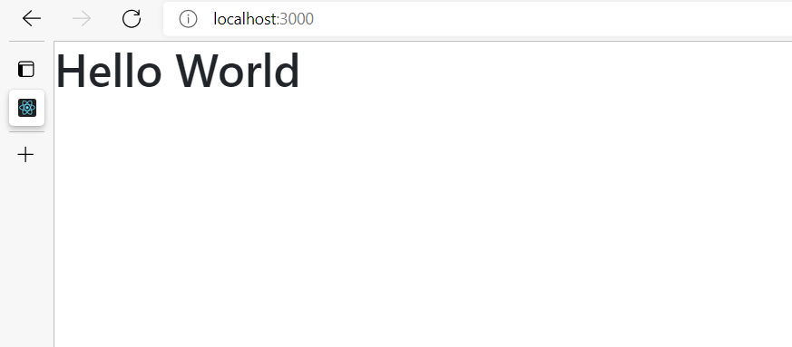

# Book Review App using ReactJS

With below steps you can learn basic concepts of ReactJS with example of Book review app

## 1. Installations

For this project we require NodeJS, Visual Studio Code and Git installed in your machine.

If any of them not installed then feel free to check this [Installation Guide](https://github.com/nehawork/book-review-app/documents/installation-guide.pdf) 

## 2. Initialization

Execute below commands for create and start react app.

```
npx create-react-app book-review-app
cd book-review-app
npm start
```

For more information related to initialization check [Initialization Steps](https://github.com/nehawork/book-review-app/documents/initialization-steps.pdf) 

## 3. Installation for required packages for design and routing

We will install two libraries using npm which would help us with using the Bootstrap library in our app to apply the styling.

```
npm install bootstrap react-bootstrap
```
Running the above command will install both react-bootstrap and bootstrap libraries in our application.


For routing we have react-router-dom library

```
npm install react-router-dom
```

## 4. Hello World using React

Let's get started with display Hello World in React.
For this our **App.js** will look like below.

```
import "./App.css";

const App = () => {
  return <h1>Hello World</h1>;
};

export default App;
```

Output:
